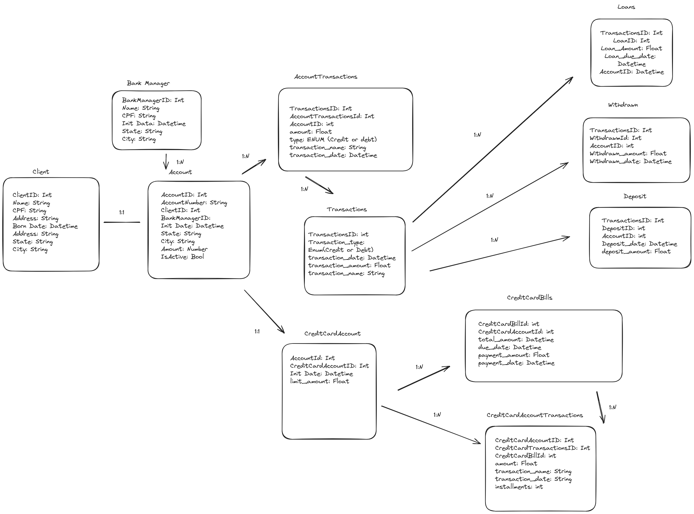

# ON36-IJS-BANCO-DA-COMUNIDADE

O banco da comunidade visa fornecer serviços financeiros básicos para a comunidade e também
fortalecer empreendedores locais cedendo crédito sem recorrer a juros.

## Serviços financeiros prestados
- Crédito para financiamento de empreendimentos solidários.
- Crédito para consumo pessoal e familiar, sem juros.
- Cartão de crédito popular solidário.
- Abertura e extrato de conta corrente.
- Depósito em conta corrente.
- Saque avulso ou com cartão magnético.
- Pagamento de contas (água, luz, telefone etc.).
- Recebimento de aposentadorias e outros valores governamentais
- Gerentes da conta
- Prestação de contas diário e semanal para toda a comunidade

## Fluxograma do projeto

## Diagrama de entidades

---
